

langkah awal membuat databasenya terlebih dahulu dengan nama sesuai pada gambar tersebut
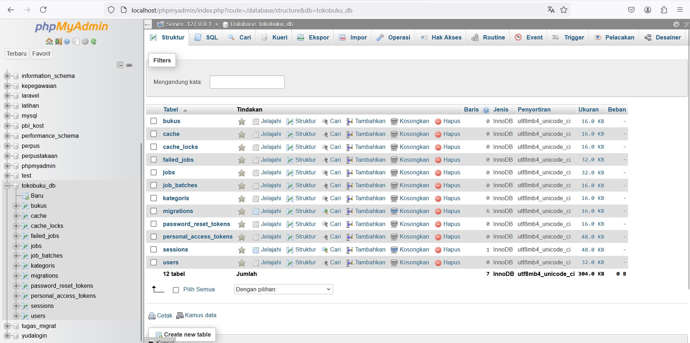

kemudian membuat file migrasi kategori dan buku selanjutnya mengisikannya kode seperti pada gambar berikut, kemudian jalankan dengan memasukkan printah php artisan migrat

selanjutnya membuat kontrollernya, dan di sini membuat dua kontroller seperti pada gambar berikut.
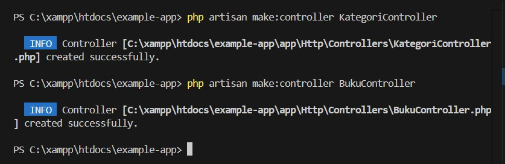

setelah membuatnya otomatis akan terbuat sendiri file-nya, selanjutnya kita isi kode untuk kategori kontrollernya seperti pada gambar berikut.

selanjutnya buat route api nya dan isikan kode program seperti pada gambar di bawah berikut, selanjutnya cek programnya berjalan atau tidak dengan menjalankan servernya dulu dengan memasukkan printan 'php artisan serve' kemudian cek melalui link port yang sudah di tampilkan, di sini saya menggunakan port 2004

jika port berhasil di akses makan akan muncul seprti gambar berikut
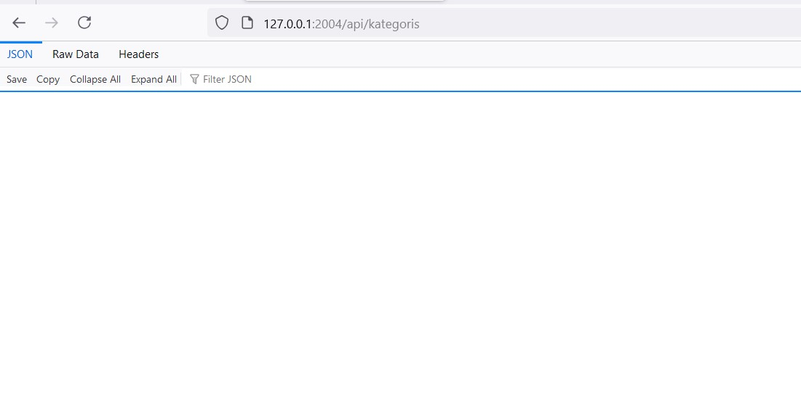

dan kita coba lihat menggunakan postman, tampilan untuk GET muncul seperti berikut ini
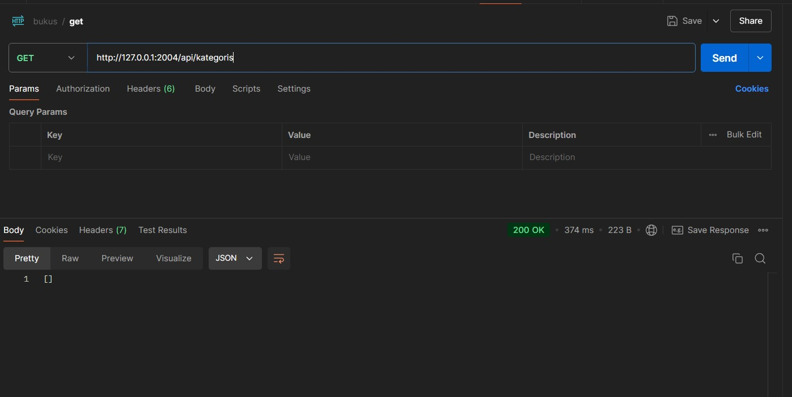

dan ini untuk cek post nya dengan memasukkan data seperti pada gambar berikut
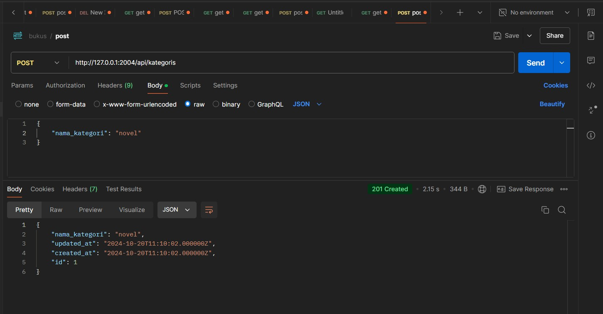

berikut tampilan get bukus
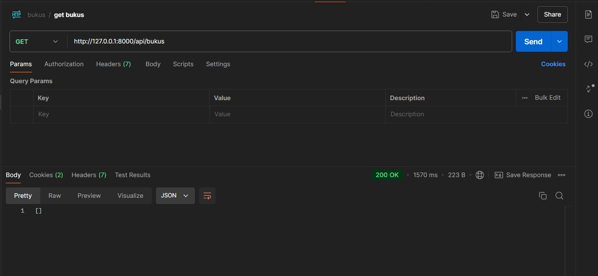

berikut tampilan POST bukus
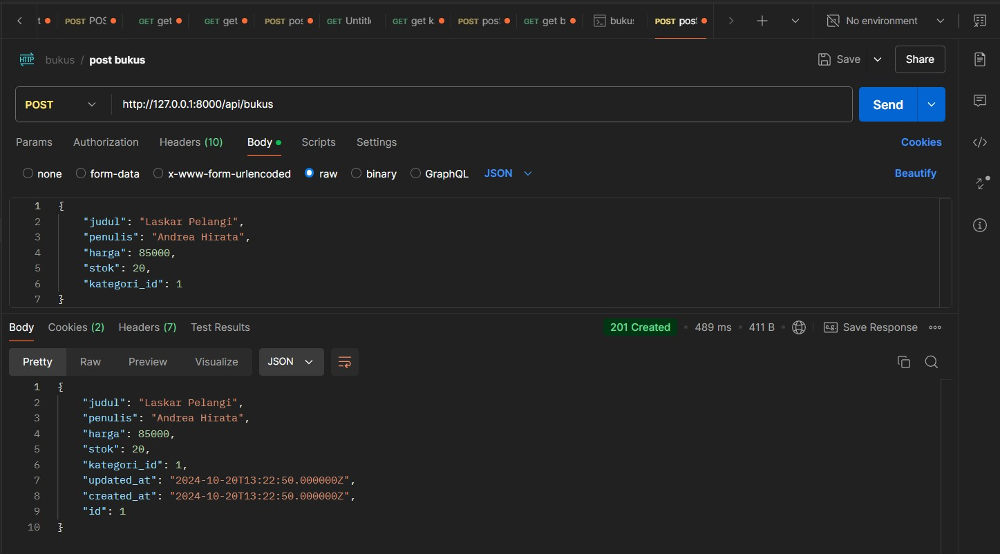

berikut tampilan update buku
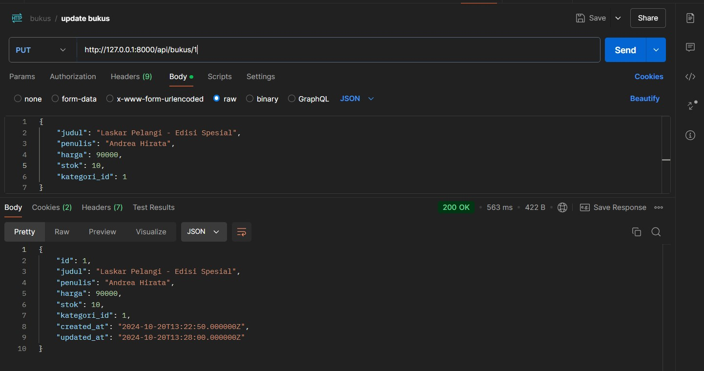

berikut tampilan delete bukus
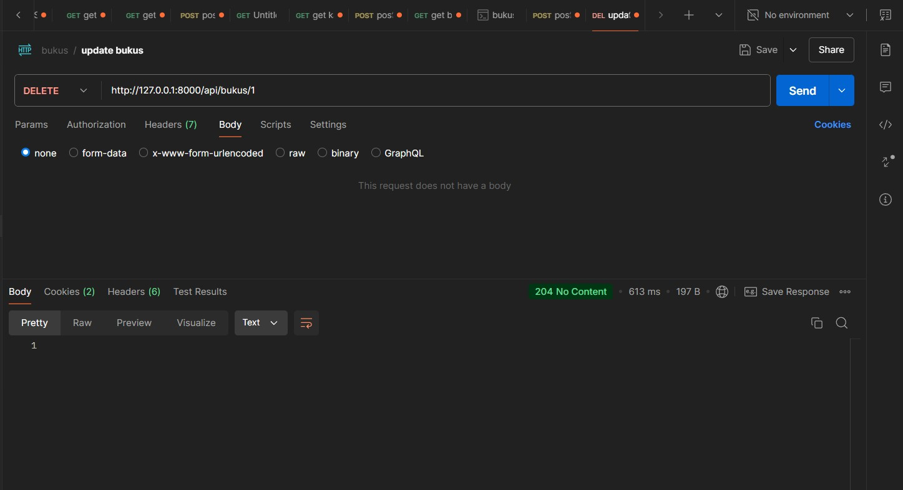

TUGAS
Tambahan validasi nama buku tidak boleh kosong dan harga minimal 1000
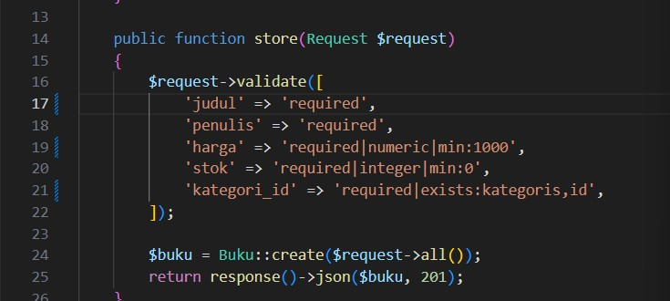

membuat endpoint baru, untuk tantangan tersendiri yaitu pengalaman pengguna yang lebih penting, karena di dalam perncarian pasti kita ingin mendapatkannya secara cepat dan tidak lemot, contohnya menampilkan hasil pencarian itu, kemudian skabilitas supaya respon ketika pencarian di jalankan tidak terlalu berat ketika yang di cari itu dalam jumlah data yang besar
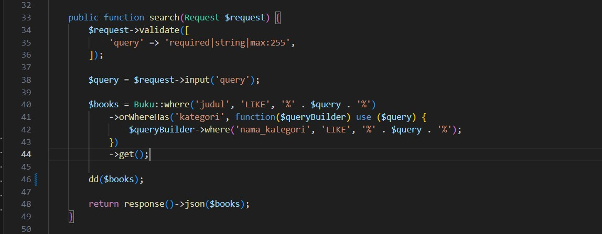

berikut link ngrok untuk membuka API ke internet
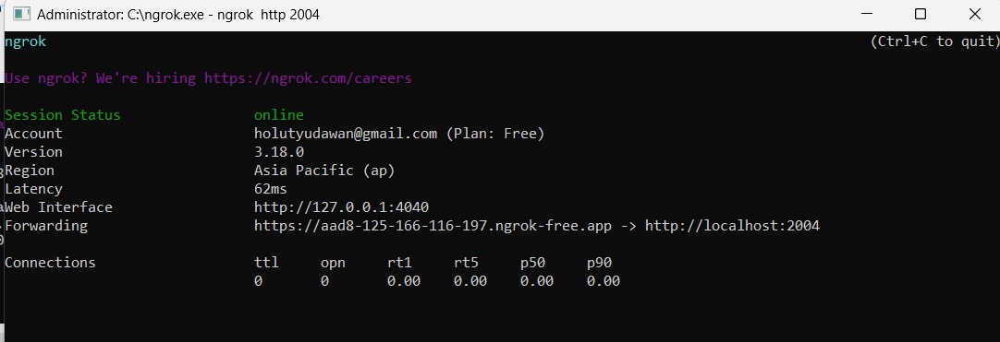

berikut link ngrok nya
https://59d0-103-164-60-13.ngrok-free.app/api/bukus

## About Laravel

Laravel is a web application framework with expressive, elegant syntax. We believe development must be an enjoyable and creative experience to be truly fulfilling. Laravel takes the pain out of development by easing common tasks used in many web projects, such as:

-   [Simple, fast routing engine](https://laravel.com/docs/routing).
-   [Powerful dependency injection container](https://laravel.com/docs/container).
-   Multiple back-ends for [session](https://laravel.com/docs/session) and [cache](https://laravel.com/docs/cache) storage.
-   Expressive, intuitive [database ORM](https://laravel.com/docs/eloquent).
-   Database agnostic [schema migrations](https://laravel.com/docs/migrations).
-   [Robust background job processing](https://laravel.com/docs/queues).
-   [Real-time event broadcasting](https://laravel.com/docs/broadcasting).

Laravel is accessible, powerful, and provides tools required for large, robust applications.

## Learning Laravel

Laravel has the most extensive and thorough [documentation](https://laravel.com/docs) and video tutorial library of all modern web application frameworks, making it a breeze to get started with the framework.

You may also try the [Laravel Bootcamp](https://bootcamp.laravel.com), where you will be guided through building a modern Laravel application from scratch.

If you don't feel like reading, [Laracasts](https://laracasts.com) can help. Laracasts contains thousands of video tutorials on a range of topics including Laravel, modern PHP, unit testing, and JavaScript. Boost your skills by digging into our comprehensive video library.

## Laravel Sponsors

We would like to extend our thanks to the following sponsors for funding Laravel development. If you are interested in becoming a sponsor, please visit the [Laravel Partners program](https://partners.laravel.com).

### Premium Partners

-   **[Vehikl](https://vehikl.com/)**
-   **[Tighten Co.](https://tighten.co)**
-   **[WebReinvent](https://webreinvent.com/)**
-   **[Kirschbaum Development Group](https://kirschbaumdevelopment.com)**
-   **[64 Robots](https://64robots.com)**
-   **[Curotec](https://www.curotec.com/services/technologies/laravel/)**
-   **[Cyber-Duck](https://cyber-duck.co.uk)**
-   **[DevSquad](https://devsquad.com/hire-laravel-developers)**
-   **[Jump24](https://jump24.co.uk)**
-   **[Redberry](https://redberry.international/laravel/)**
-   **[Active Logic](https://activelogic.com)**
-   **[byte5](https://byte5.de)**
-   **[OP.GG](https://op.gg)**

## Contributing

Thank you for considering contributing to the Laravel framework! The contribution guide can be found in the [Laravel documentation](https://laravel.com/docs/contributions).

## Code of Conduct

In order to ensure that the Laravel community is welcoming to all, please review and abide by the [Code of Conduct](https://laravel.com/docs/contributions#code-of-conduct).

## Security Vulnerabilities

If you discover a security vulnerability within Laravel, please send an e-mail to Taylor Otwell via [taylor@laravel.com](mailto:taylor@laravel.com). All security vulnerabilities will be promptly addressed.

## License

The Laravel framework is open-sourced software licensed under the [MIT license](https://opensource.org/licenses/MIT).
